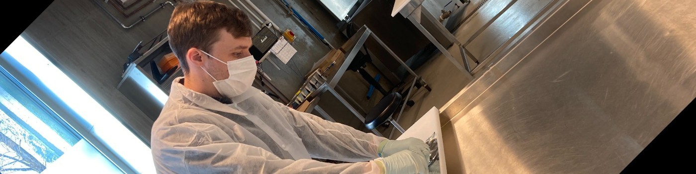
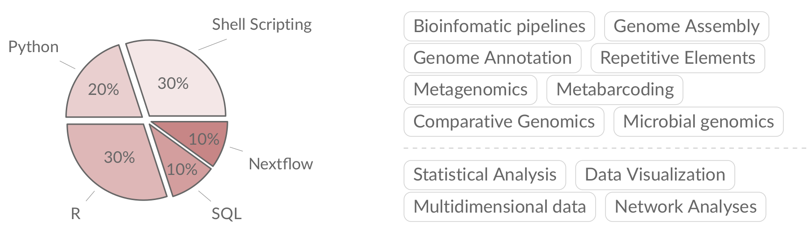

## `whoami`

👋 I am a microbiologist by training, but most of my research has focused on the genomics of fungal zoonoses, microbiomes of wild animals, and now large transposible elements in fungal genomes.

## "What exactly do you do here?"

## Employment

I am a Researcher at Uppsala University in the Department of Systematics, where my research focuses on identifying and annotating large repetitive elements in fungal pathogen genomes. My research will help to better understand the incredible plasticity present in fungal genomes. Right now, I am working on identifying genes that are involved with the movement and function of some extremely large transposible elements, The [Starships](https://doi.org/10.1093/molbev/msac109).

## Education

- PhD in Microbiology (2016-2020)
  - McMaster University, Hamilton, Canada
- M.Sc. in Microbiology (2014-2016)
  - McMaster University, Hamilton, Canada
- H. B.Sc. in Biology, Honors (2010-2014)
  - Trent University, Peterborough, Canada

## Research Projects

### PhD Thesis

In my PhD I used genomics to study the microbial ecology and population structure of the fungal pathogen, _Pseudogymnoascus destructans_. Find more about my thesis [here](https://adrianforsythe.github.io/posts/2020/09/phdthesis/index.html).
- [An interview about my PhD research on McMaster's Science Podcast](https://d3ctxlq1ktw2nl.cloudfront.net/staging/2019-9-3/25951353-44100-2-6d37e687523c.m4a)\

### Probiotics for White-Nose Syndrome

I helped to develop a probiotic treatment for White-Nose Syndrome in bats, which is current undergoing field trials in British Columbia, Canada. I contributed to this project by screening bacterial strains for antifungal activity and optimizing the dosage and delivery system in preparation for field trials. I monitored probiotic levels in the field using quantitative assays. I also processed all genomic data generated from this project.
[Press Coverage of this Project](cbc.ca/news/canada/british-columbia/bats-white-nose-syndrome-scientists-1.5247454)

### Geocaching and WNS

Recently I have been working on a project to use novel data streams to investigate the connection between human activity and the spread of the WNS pathogen in North America.

Read more about this project [here](https://adrianforsythe.github.io/posts/2020/01/DoesHumanActivityContributetotheSpreadofWhiteNoseSyndrome/index.html).

