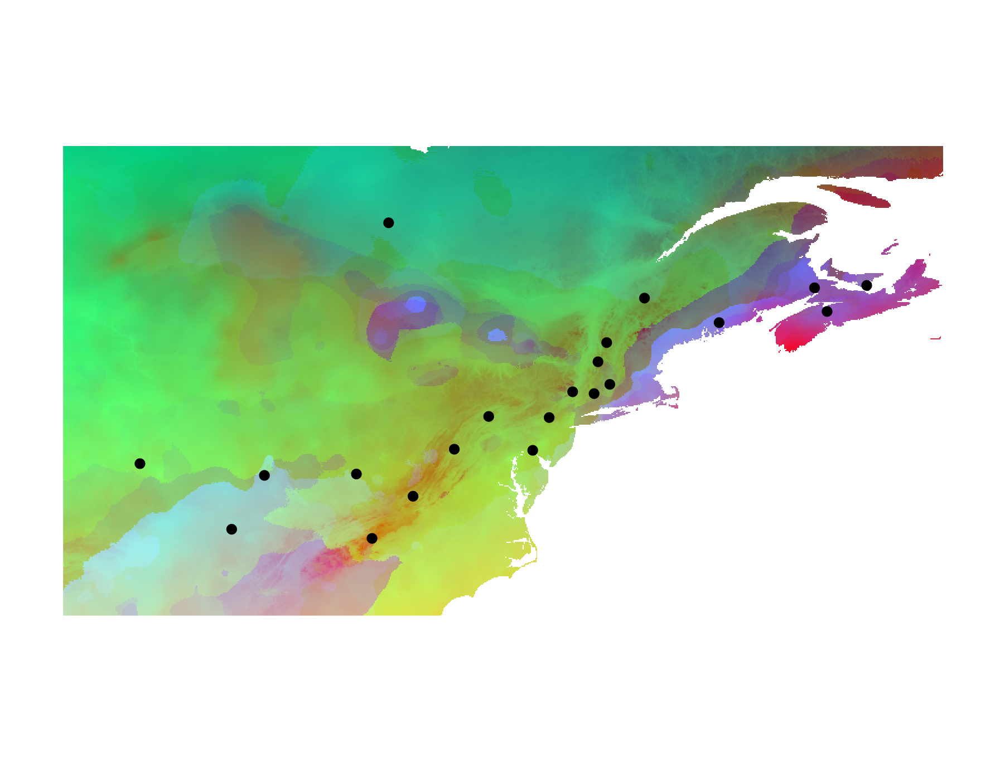
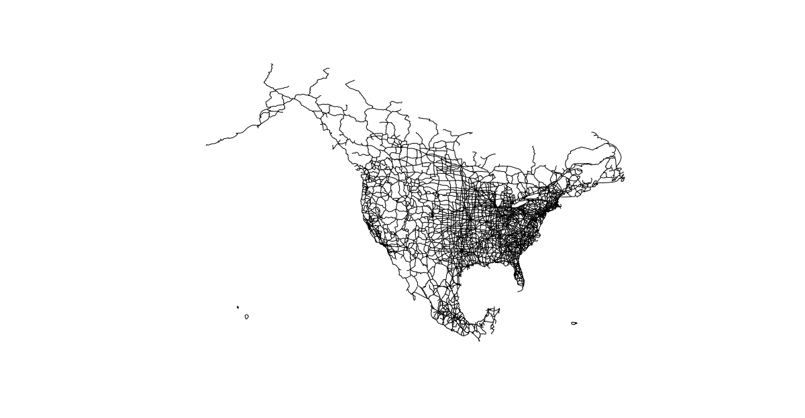

I am a PhD Candidate in the Department of Biology at McMaster University. In the Xu Lab, I conduct research on the genetics/genomics of fungal pathogens. I am interested in the factors that promote rapid adaptation of pathogens to non-native hosts/environments.

