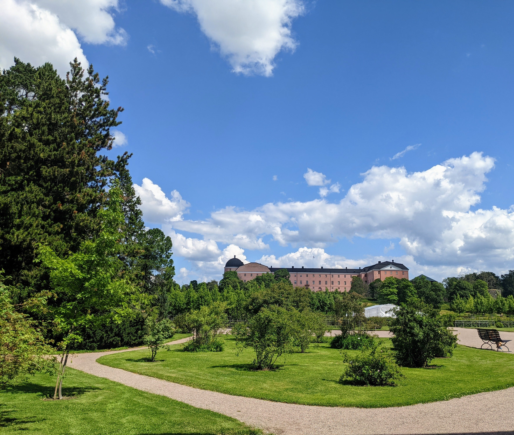
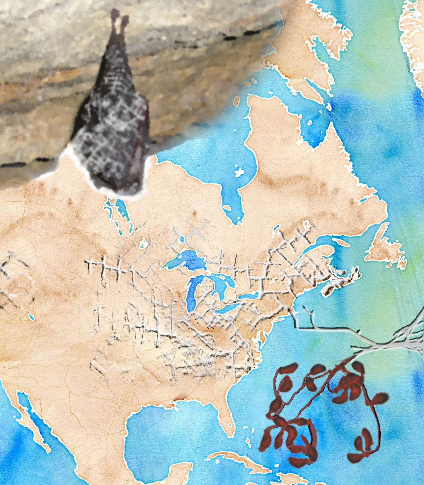

## Employment

 am a PostDoc in the Guschanski Lab (Uppsala University), where my research focuses on both the ancient and modern microbiomes of wild mammals and identifying antimicrobial resistance factors within these communities. The goal of my research is to ultimately contribute to conservation efforts to curb disruptions to microbial ecosystems.

## General Interests

In general, most of my work has been focused on the intersection between 'wet' and 'dry' lab work.
I apply my knowledge of ecology and microbiology to address problems using genomic tools. I am particularly interested in pathogens, host-microbe interactions, and anthropogenic influences on microbial communities.

<!-- ## Technical Skills

- Shell/BASH
- R

  - tidyverse
  - plotly
  - Rshiny

- python

  - pandas
  - scikitlearn
  - snakemake

- Desktop Linux
- CLI Unix
- Docker
- Singularity
- conda
- Nextflow
- Web Scraping
  - RSelenium
  - beautifulsoup4
- Dimension Reduction Techniques
  - PCA
  - UMAP
- Network Analyses
- ML

  - Random Forest
  - Linear discriminant analysis

- Wet and Dry Lab Skills
- Hypothesis testing
- Data Analysis and Visualization
- Statistical Analysis

- Microbial genetics
- Genome Assembly and Annotation
- Metagenomics/Metabarcoding
- Landscape Genetics
- Pangenomics

## Education

- Phd in Microbiology (2016-2020)
  - McMaster University, Hamilton, Canada
- MSc in Microbiology (2014-2016)
  - McMaster University, Hamilton, Canada
- H. BSc in Biology, Honours (2010-2014)
  - Tren University, Peterborough, Canada -->

## Research Projects

### PhD Thesis

In my PhD I used genomics to study the microbial ecology and population structure of the fungal pathogen, _Pseudogymnoascus destructans_. Find more about my thesis [here](https://adrianforsythe.github.io/posts/2020/09/phdthesis/index.html).

## [An interview about my PhD research on McMaster's Science Podcast](https://d3ctxlq1ktw2nl.cloudfront.net/staging/2019-9-3/25951353-44100-2-6d37e687523c.m4a)\

### Probiotics for White-Nose Syndrome

I helped to develop a probiotic treatment for White-Nose Syndrome in bats, which is current undergoing field trials in British Columbia, Canada. I contributed to this project by screening bacterial strains for antifungal activity and optimizing the dosage and delivery system in preparation for field trials. I monitored probiotic levels in the field using quantitative assays. I also processed all genomic data generated from this project.
[Press Coverage of this Project](cbc.ca/news/canada/british-columbia/bats-white-nose-syndrome-scientists-1.5247454)

### Geochaching and WNS

Recently I have been working on a project to use novel data streams to investigate the connection between human activity and the spread of the WNS pathogen in North America.

Read more about this project [here](https://adrianforsythe.github.io/posts/2020/01/DoesHumanActivityContributetotheSpreadofWhiteNoseSyndrome/index.html).

