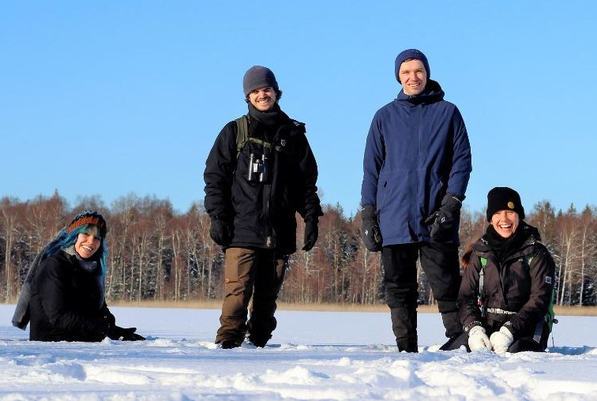

## `whoami`

👋 Hi there! My name is Adrian, I am a (micro)biologist by training, and I use genomics to ask solve problems caused by pathogens that live on wild animals. I am particularly interested in fungal pathogens, host-microbiome interactions, and how humans disrupt wild microbial communities.

\

## "What exactly do you do here?"

\

## Employment

I am about to start a new PostDoc position in the Vogan Lab (Uppsala University), where my research will focuse on the identification and annotation of repetitive elements in the genomes of a fungal ascomycete pathogen. Stay tuned for more info...
\

I just finished a PostDoc in the Guschanski Lab (Uppsala University), where my research focused on both the ancient and modern microbiomes of wild mammals and identifying antimicrobial resistance factors within these communities. The goal of my research is to ultimately contribute to conservation efforts to curb disruptions to microbial ecosystems.\
\

## Education

- Phd in Microbiology (2016-2020)
  - McMaster University, Hamilton, Canada
- MSc in Microbiology (2014-2016)
  - McMaster University, Hamilton, Canada
- H. BSc in Biology, Honours (2010-2014)
  - Tren University, Peterborough, Canada -->

## Research Projects

### PhD Thesis

In my PhD I used genomics to study the microbial ecology and population structure of the fungal pathogen, _Pseudogymnoascus destructans_. Find more about my thesis [here](https://adrianforsythe.github.io/posts/2020/09/phdthesis/index.html).

## [An interview about my PhD research on McMaster's Science Podcast](https://d3ctxlq1ktw2nl.cloudfront.net/staging/2019-9-3/25951353-44100-2-6d37e687523c.m4a)\

### Probiotics for White-Nose Syndrome

I helped to develop a probiotic treatment for White-Nose Syndrome in bats, which is current undergoing field trials in British Columbia, Canada. I contributed to this project by screening bacterial strains for antifungal activity and optimizing the dosage and delivery system in preparation for field trials. I monitored probiotic levels in the field using quantitative assays. I also processed all genomic data generated from this project.
[Press Coverage of this Project](cbc.ca/news/canada/british-columbia/bats-white-nose-syndrome-scientists-1.5247454)

### Geochaching and WNS

Recently I have been working on a project to use novel data streams to investigate the connection between human activity and the spread of the WNS pathogen in North America.

Read more about this project [here](https://adrianforsythe.github.io/posts/2020/01/DoesHumanActivityContributetotheSpreadofWhiteNoseSyndrome/index.html).

